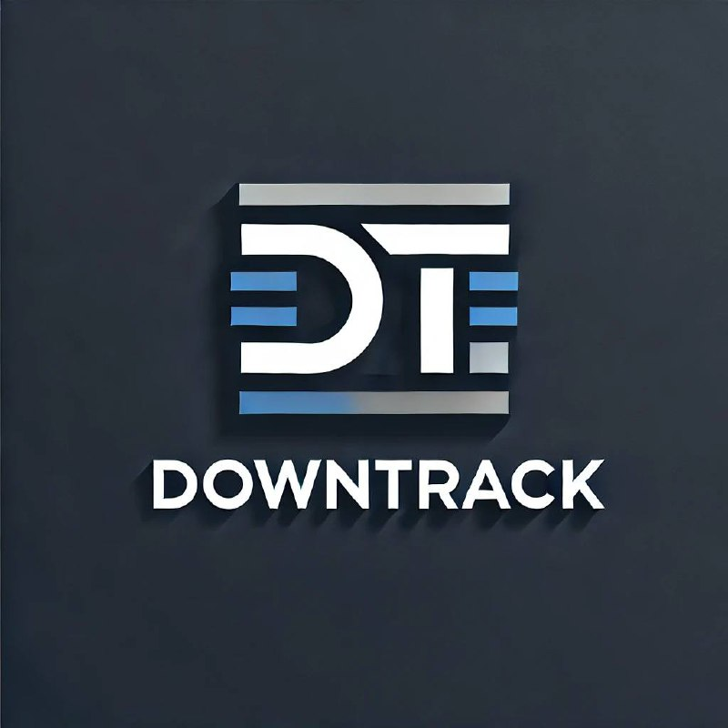

 
<h1 style="text-align: center;">
  Gestión de Bajas Técnicas
   
  
</h1>

## Descripción del Proyecto

Este repositorio contiene el desarrollo de una aplicación web diseñada para gestionar las bajas técnicas en una empresa de infocomunicaciones. El sistema busca automatizar procesos como el manejo de inventarios, bajas, traslados y mantenimientos de equipos, ofreciendo una solución eficiente y centralizada.

## Arquitectura

El proyecto está desarrollado siguiendo la **Arquitectura Clean**, lo que garantiza un diseño desacoplado, extensible y mantenible.

## Tecnologías Utilizadas

- **Backend**:  
  - **.NET 8.0**: Framework principal para el desarrollo del backend.  
  - **Entity Framework Core**: ORM para la gestión de la base de datos.

- **Frontend**:  
  - **React.js**: Biblioteca para construir interfaces de usuario dinámicas.

- **Base de Datos**:  
  - **MySQL**: Sistema de gestión de base de datos relacional.

## Funcionalidades Principales

1. Gestión del inventario de equipos.
2. Registro y consulta de mantenimientos técnicos.
3. Control de bajas técnicas con detalles de causa y destino.
4. Gestión de traslados entre secciones y unidades.
5. Generación de reportes en formatos visuales y exportables a PDF.
6. Evaluación del rendimiento de los técnicos con base en su historial de intervenciones y valoraciones.

## Requisitos del Sistema

- **Backend**: .NET 8.0  
- **Frontend**: Node.js 16+  
- **Base de Datos**: MySQL 8.0+  

---
